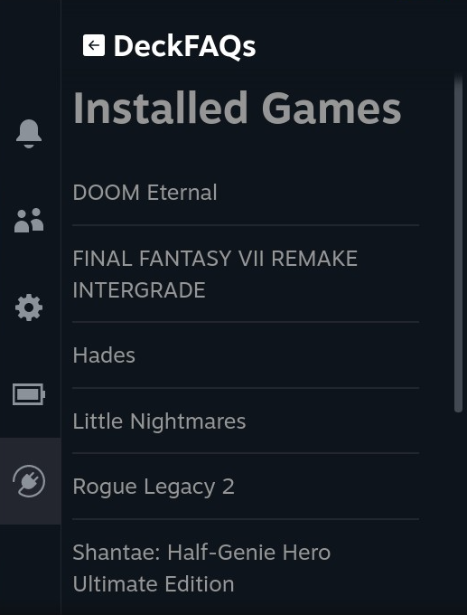
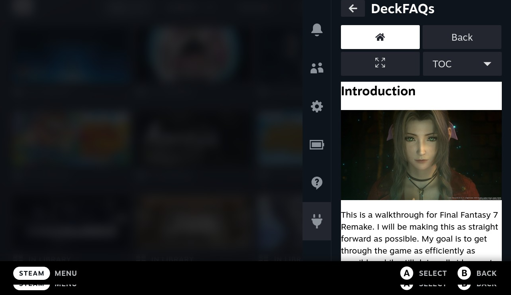

# DeckFAQs
## Description
A GameFAQs browser for the Steam Deck. This plugin supports both Steam and non-Steam games (like things setup with Steam Rom Manager for example)

Built with the [Steam Deck Plugin Loader](https://github.com/SteamDeckHomebrew/PluginLoader).

## How to Install
1. You need to install [Plugin Loader](https://github.com/SteamDeckHomebrew/PluginLoader#installation) first before getting started.
2. Download/Install Steps
    * (**RECOMMENDED**) Install from PluginLoader directly. DeckFAQs is now on the PluginLoader browser. You can access it by tapping the shopping bag icon from Plugin Loader and looking for "deckfaqs_pluginbrowser". 
        * **Note that if you previously installed DeckFAQs with one of the options below, you should first uninstall that by running `sudo rm -r /home/deck/homebrew/plugins/deckfaqs` or `curl -L https://github.com/hulkrelax/deckfaqs/raw/main/scripts/uninstall.sh | sh`**
    * Install with script 
    `curl -L https://github.com/hulkrelax/deckfaqs/raw/main/scripts/install_plugin.sh | sh`
    * or Install manually 
    `curl -LJO https://github.com/hulkrelax/deckfaqs/releases/download/v0.1.1/deckfaqs.tar.gz` 
    `sudo tar -xvf deckfaqs.tar.gz -C /home/deck/homebrew/plugins/`

## Features
DeckFAQs supports both rich-text and plain-text guides from GameFAQs. Rich-text guides are displayed in an iframe while plain-text guides are rendered directly in the side-panel

### Game List

### Search Results

### Guides

### Rich-text Guide

### Plain-text Guide

## Known Issues
- It is possible that some non-game games (thins like Chrome) will show up in your list of games. I have a filter to remove some obvious non-games but the list is non-exhaustive. We can always expand the filter to remove them over time. In any case, it doesn't really break anything as far as I know and hopefully you have more games than non-games :smile:

Report issues or feature requests [here](https://github.com/hulkrelax/deckfaqs/issues).