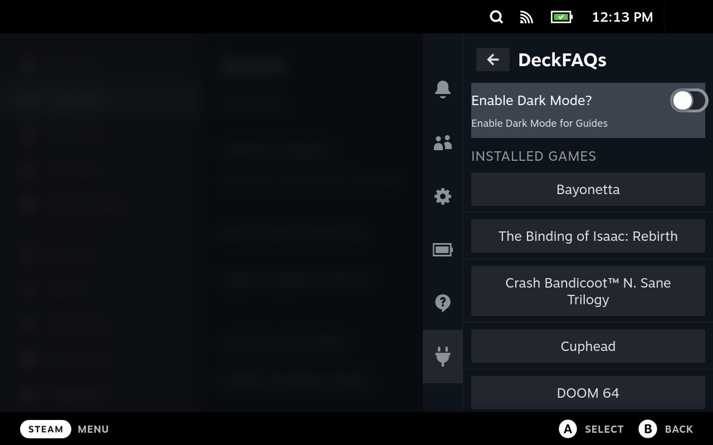
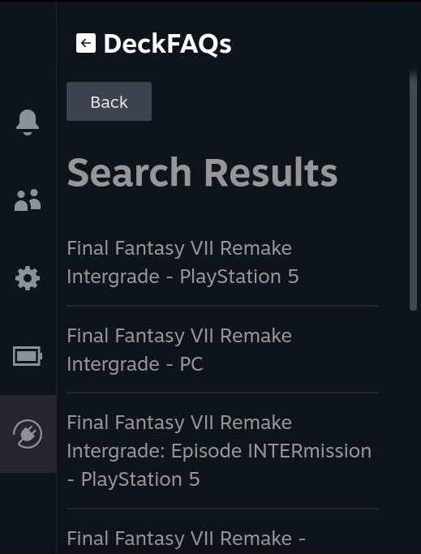
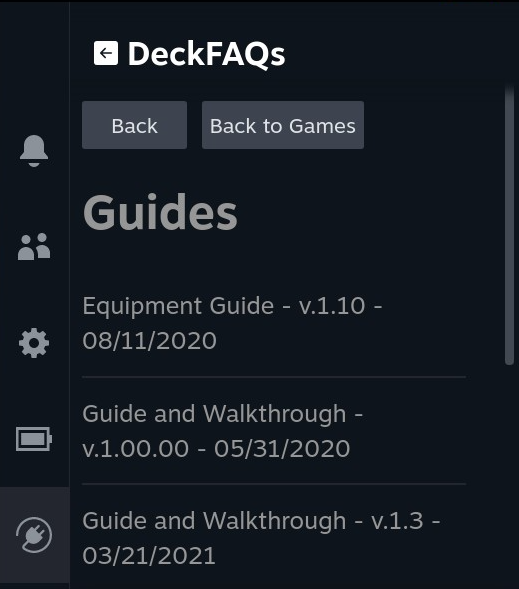
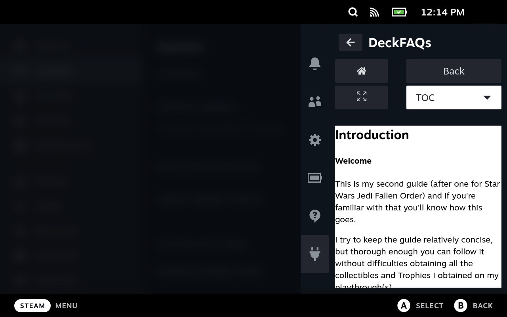
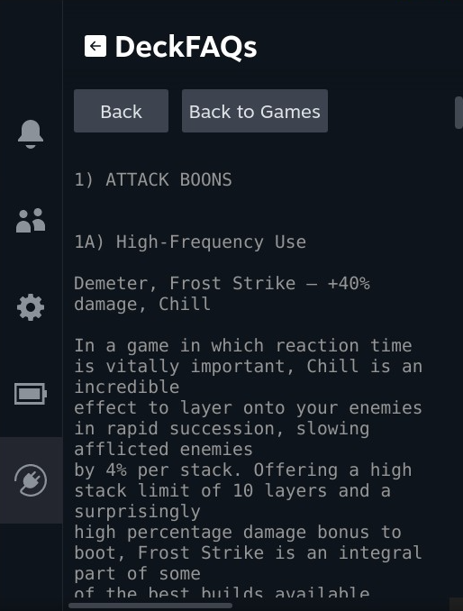
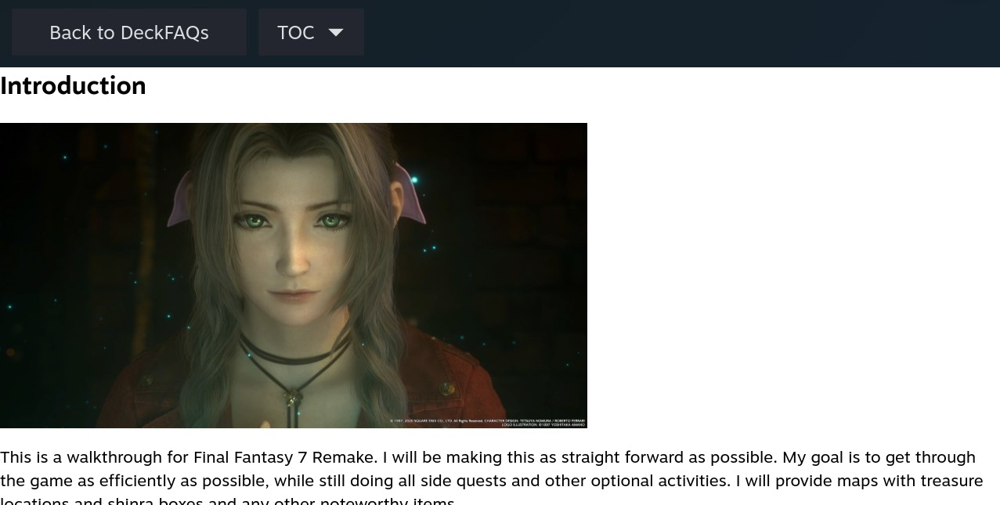
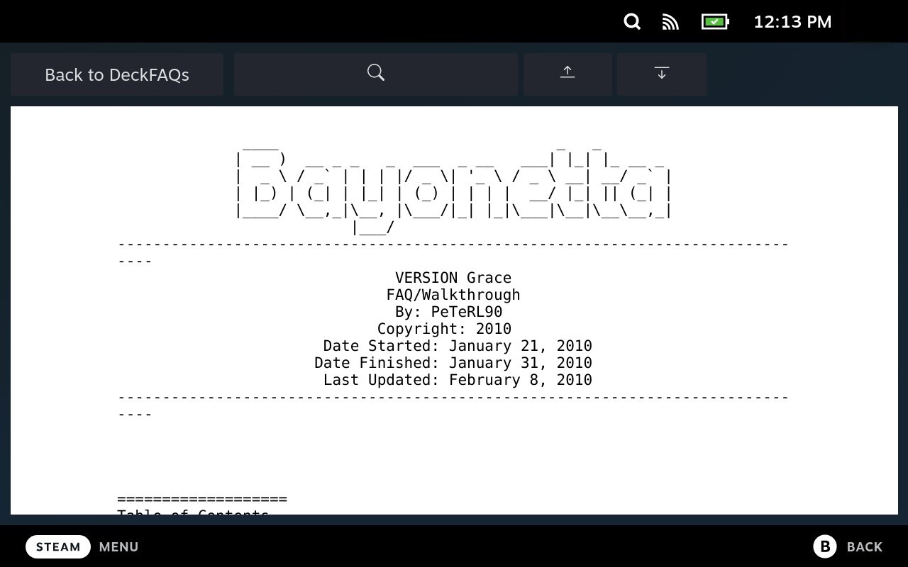
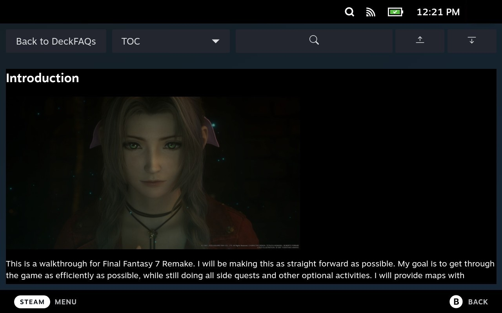
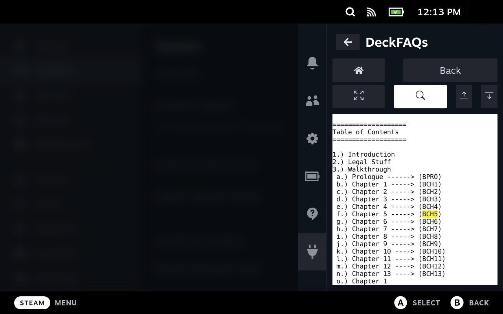

# DeckFAQs

## Description

A GameFAQs browser for the Steam Deck. This plugin supports both Steam and non-Steam games (like things setup with Steam Rom Manager for example)

Built with [Decky Loader](https://github.com/SteamDeckHomebrew/PluginLoader).

## How to Install

### Current Version (Decky Loader version)

1. You need to install the [Decky Loader pre-release](https://github.com/SteamDeckHomebrew/PluginLoader#installation) first before getting started.
2. Download/Install Steps
    - Install from Decky Loader directly. DeckFAQs is on the Decky Loader store browser. Be sure to download DeckFAQs and not "deckfaqs_plugin_browser" which is legacy and no longer supported

## Features

DeckFAQs supports both rich-text and plain-text guides from GameFAQs.

### Game List

### Search Results

### Guides

### Rich-text Guide

### Plain-text Guide

### Fullscreen Guide

### Dark Mode

### Search

## Known Issues

-   It is possible that some non-game games (thins like Chrome) will show up in your list of games. I have a filter to remove some obvious non-games but the list is non-exhaustive. We can always expand the filter to remove them over time. In any case, it doesn't really break anything as far as I know and hopefully you have more games than non-games :smile:

Report issues or feature requests [here](https://github.com/hulkrelax/deckfaqs/issues).
